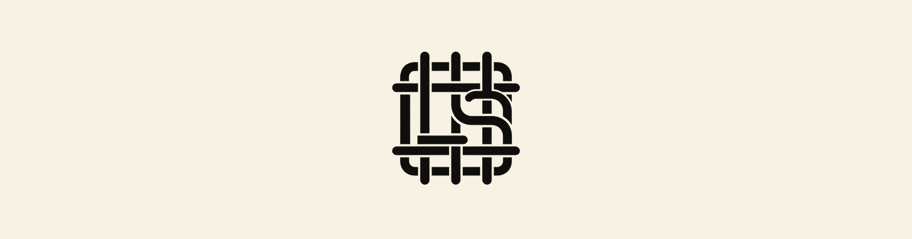

  <picture>
    <source media="(prefers-color-scheme: dark)" srcset="assets/loomseal-banner-dark.png">
    
  </picture>

# LoomSeal

**Proof, not promises.**

An open format for evidence somebody else can check.

You already have a record of what your software did. The trouble is that the person who needs to
believe it, an auditor, a customer, a security reviewer, a regulator, cannot, because you own the
system that record lives in. Your log is worth exactly as much as their trust in you.

LoomSeal turns that record into one JSON file: the claims, the digests of the evidence behind
them, their position in an append-only hash chain, the anchors that fix that chain in time, and
an ed25519 signature from the machine that produced it. You send the file. They run a verifier
and get a yes or a no in seconds, offline. You are not in the loop, which is the point.

## Free, and structurally so

This is not a trial, an open-core tease, or a format with a paid tier waiting behind it.

- **Apache-2.0.** Adopt it, fork it, re-implement it, ship it in a competing product. No
  negotiation, no license call, no per-seat price, no permission.
- **Nothing to charge for.** LoomSeal is a file format and a checker. There is no server to rent
  and no seat to meter, which is why it is free permanently rather than free for now.
- **Verification never phones home.** No account, no server, no network, no telemetry. The
  verifier works on a machine that has never heard of KordLoom and never will.
- **Auditable end to end.** The binary has no dependencies outside the Go standard library, so
  every line that touches a verification decision is in this repository and readable in an
  afternoon. A tool that checks evidence should not itself have to be taken on faith.
- **Two independent implementations already.** The Go verifier here and a separate Python one in
  `reference/`, cross-checked in CI against the same conformance vectors. A format with one
  implementation is a product. A format with two is a standard.

One binary. One file. Provable.

## How it works

Three things happen while your software runs, and one happens when somebody asks.

**1. Your software records what it did.** Nothing new here. You already keep audit entries.

**2. Each entry is hashed together with the one before it.** An entry's link is a hash over its
own contents plus the previous entry's link. It is cheap, it happens inline, and it needs no
coordination with anyone.

    entry 1    link1 = H(claim1, "")
    entry 2    link2 = H(claim2, link1)
    entry 3    link3 = H(claim3, link2)

Alter or delete anything earlier and every link after it changes. There is no way to edit the
middle of a chain and leave the end intact.

**3. Every so often, the current head link is published where you do not control it.** A git
commit, an RFC 3161 timestamp, a transparency log. It is one 64-character string, so it costs
nothing to publish. This is the anchor, and it is the step that does the real work: it turns
"I have a hash chain" into "I was already recording this before that date, and here is a third
party who saw it."

**4. When somebody asks for evidence, you export a bundle.** The claims for the window they care
about, digests of any evidence files, the chain coordinates, the anchors, and one ed25519
signature over the whole document.

Verification runs that in reverse, offline:

- The signature confirms the bundle came from the key holder and that not one byte moved since.
- Every link is recomputed from the claim contents and compared to the link on record.
- Every `prev` is checked against the actual previous link, so a removed or reordered entry
  shows up immediately, and the verifier names where.
- Anchor coordinates are matched against links in the chain.

**Why this cannot be faked after the fact.** The chain is built as you go, not assembled at
export time. To produce a forgery that survives, you would have had to be lying from the very
first entry and publishing the fake heads to a third party the whole way. Nobody backfills an
anchored history. That is the entire security argument, and it is why the moat here is time
rather than cryptography.

## Install

    go install github.com/kordloom/loomseal@latest

Or build from source:

    go build -o loomseal .

The binary has no dependencies outside the Go standard library, so every line that touches a
verification decision is in this repository.

## Verify a bundle

    loomseal verify examples/audit.loomseal.json --evidence examples/evidence

The output, reproducible from this repository right now:

    bundle     lsb_example_0001 from loomseal-demo 0.1.0
    subject    fleet demo-yard
    signature  ok, key sha256:f8840a25992b58b823321187e1c44d36ee1a748023034a46d26ea93419edaf07
    chain      loomseal-chain-v1, full, 2 claims, head matched true
    anchors    1 matched by coordinates, 0 proof(s) carried, 0 verified
    evidence   1 verified, 0 missing, 0 referenced only
    VERIFIED   signed, chained (full), anchored by reference

Flags: `--evidence <dir>` checks artifact digests against files you were given,
`--fingerprint sha256:<hex>` pins the producer key to the fingerprint published on the
operator's trust page, `--json` emits the report for machines, `--pretty` indents it. Exit
codes: 0 verified, 1 verification failed, 2 usage or read error.

## What verification proves

Run `loomseal verify` on one file and, seconds later, offline, with no account and no trust in
KordLoom or the operator who sent it, you know three things:

- The producer holding the signing key assembled these exact claims. Flip one byte anywhere in
  the bundle and the signature fails, loudly, with the break named.
- The claims sit in an append-only chain that has not been reordered, rewritten, or trimmed
  since its heads were anchored outside the producer's reach. Anchored history cannot be
  manufactured after the fact, at any price, by anyone. Whoever has been recording, wins.
- Every artifact you were handed matches its recorded digest exactly: the page as it stood,
  the run as it happened, the approval as it was given.

Send that file to an auditor, a security reviewer, a customer, a regulator, or another
machine. None of them has to believe a word you say. That is the point.

KordLoom uses this on its own products for a reason that is a little uncomfortable.
SwitchTender's promise is that it proves every change. Without a bundle, that promise is a
sentence on a website, and you would simply have to believe us that the audit trail behind it
is honest. Building on `do not take our word for it` and then asking you to take our word for
it is not a position we can defend, so SwitchTender's audit export is being rebuilt as a
LoomSeal bundle.

And because proof that overclaims is just marketing, the verifier states its boundary plainly:
it cannot prove the recorder observed the world honestly at capture time. A chain fixes the
record, not the character of the recorder. Keyed chains verify structurally here and fully for
the key holder. An `rfc3161` anchor is checked here, against the link it attests to and the
certificate it carries, so it needs no network and no trust in the producer; anchors of other
types are confirmed by fetching what they point at. The full discipline is in
[FORMAT.md](FORMAT.md), which is the specification, and the conformance wording is exactly three
words: signed, chained, anchored. Anchored says how it was established, by reference or by a
verified proof, and nothing else is added.

Why it exists, what it is worth, the cryptography, quantum computers, and what happens if
KordLoom disappears: [docs/FAQ.md](docs/FAQ.md).

## Emit the format

Producers use the [seal](seal) package to sign bundles and compute generic chain links:

    import "github.com/kordloom/loomseal/seal"

    signed, err := seal.SignBundle(raw, privateKey)

The format document is [FORMAT.md](FORMAT.md); the schema is
[schema/loomseal-bundle.schema.json](schema/loomseal-bundle.schema.json). New claim types enter
through the registry in the spec.

## Status

Format v0.1 draft. The format, the schema, the verifier, and the seal package are complete,
tested, and exercised by the example bundle in this repository. SwitchTender emits LoomSeal
bundles as of v1.35.0: `switchtender audit bundle` signs its audit chain into a bundle anyone can
verify offline with the binary in this repo.

## License

Apache-2.0. The format, the schema, and this verifier are open so the proof can be checked by
people who have no reason to trust the producer. KordLoom's products are licensed separately.
